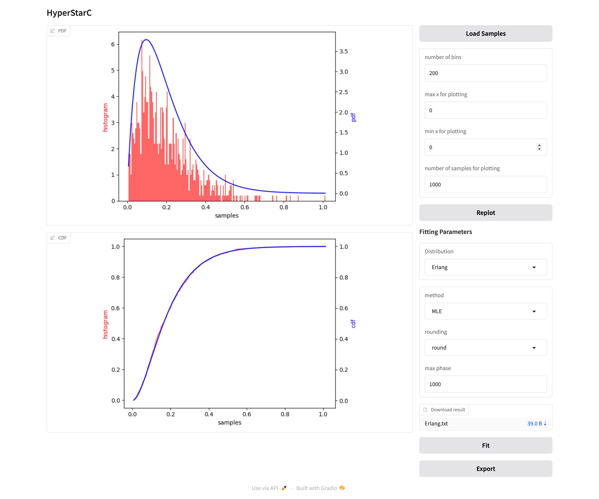

# HyperStarC

> **⚠️ Maintenance Notice**: This project is not actively maintained. While the code is functional and can be used as-is, users should expect limited support, infrequent updates, and potential compatibility issues with newer dependencies.

A statistical modeling tool for fitting time series data into phase-type distributions, specifically exponential, Erlang, and hyper-Erlang distributions. This tool is designed for performance evaluation of computer systems, networks, and queuing systems.

## Overview

HyperStarC is based on the methodology described in the paper [HyperStart2](https://doi.org/10.1145/3030207.3030243), with modifications to improve fitting accuracy. The tool enables accurate fitting of empirical time series data to structured probabilistic models and supports flexible modeling using hyper-Erlang distributions, which can represent multi-modal and heavy-tailed inter-arrival times more accurately than simple exponential models.

## Features

- **Multiple Distribution Support**: Fits input samples to exponential, Erlang, or hyper-Erlang distributions
- **Interactive Web Interface**: User-friendly Gradio-based web interface for easy data analysis
- **Visualization**: Comprehensive plotting of PDF, CDF, and correlation analysis
- **Sample Processing**: Built-in handlers for sample loading and preprocessing
- **Extensible Architecture**: Modular design for future extensions (MAP fitting in development)
- **Example Datasets**: Includes sample datasets and generation scripts for testing

## Installation

### Prerequisites

- Python 3.13 or higher
- pip package manager

### Quick Installation

```bash
# Clone the repository
git clone <repository-url>
cd HyperStarC

# Install the package
pip install -e .
```

## Usage

### Running the Application

```bash
python -m hyperstarc.main
```

This will launch a web interface accessible at `http://localhost:7860` (default Gradio port).



### Using the Web Interface

1. **Load Samples**: Click "Load Samples" to upload your time series data (text file with one value per line)
2. **Configure Plotting**: Adjust visualization parameters:
   - Number of histogram bins
   - X-axis range for plotting
   - Number of samples for plotting
3. **Select Distribution**: Choose from:
   - Exponential distribution
   - Erlang distribution
   - Hyper-Erlang distribution
4. **Fit Parameters**: Configure distribution-specific parameters
5. **Analyze**: Click "Fit" to perform the fitting and view results

### Example Data

The `samples/` directory contains example datasets:

- `exp_samples.txt` - Exponential distribution samples
- `gamma_samples.txt` - Gamma/Erlang distribution samples 
- `her.txt` - Hyper-Erlang distribution samples

The datasets are generated using the python script in the `samples/` directory.

## Dependencies

- **gradio** (≥5.23.3) - Web interface framework
- **matplotlib** (≥3.10.1) - Plotting and visualization
- **scikit-learn** (≥1.6.1) - Machine learning utilities
- **scipy** (≥1.15.2) - Scientific computing


## Development Status

### Current Features
- ✅ Exponential distribution fitting
- ✅ Erlang distribution fitting
- ✅ Hyper-Erlang distribution fitting
- ✅ Interactive web interface
- ✅ PDF/CDF visualization
- ✅ Export functionality

### In Development
- 🚧 Markov Arrival Process (MAP) fitting
- 🚧 Enhanced correlation analysis

## References

This project is based on the research described in:

**HyperStart2**: A Tool for the Automatic Generation of Trace-Driven Workloads  
*Proceedings of the 8th EAI International Conference on Performance Evaluation Methodologies and Tools*  
[DOI: 10.1145/3030207.3030243](https://doi.org/10.1145/3030207.3030243)

**Note**: The implementation includes modifications and improvements over the original paper's methodology for enhanced fitting accuracy.

## License

Apache License Version 2.0