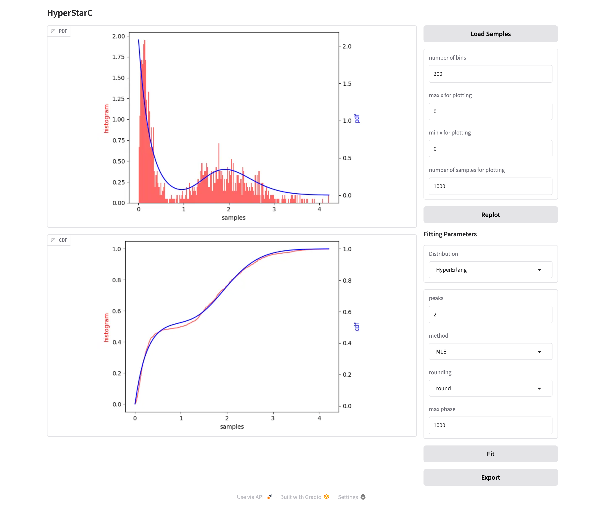

This tool fits a time series into a Hyper-Erlang distribution or an Markov arrival process. Here is the paper [HyperStart2](https://doi.org/10.1145/3030207.3030243) describing how it works. The code may be different from the paper. I made some changes to make it more accurate.

Now it can only fit given samples to an exponentiall distribution, an Erlang distribution, or a hyper-Erlang distribution. I am working on MAP.

